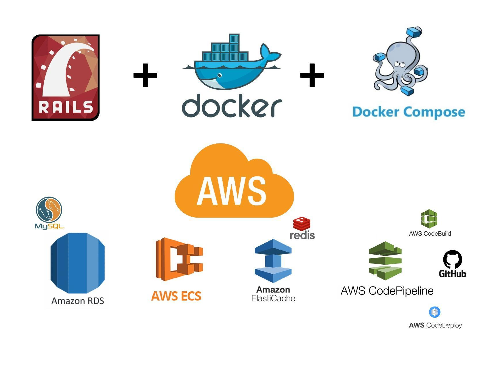

# Rails AWS Build Deploy

## Requirements

This project builds and deploys a "Hello World" Rails application connected to PostgreSQL and Redis. These would be provisioned on AWS and every service would be monitored/watched to keep track of performance and reliability.

Key Points:
- Quality of provisioning script
- Accuracy of the documentation on how to spin up the environment
- Key behaviors of the services hooked up on monitoring
- Alerting rules used on monitoring
- Explanation of watched metrics

